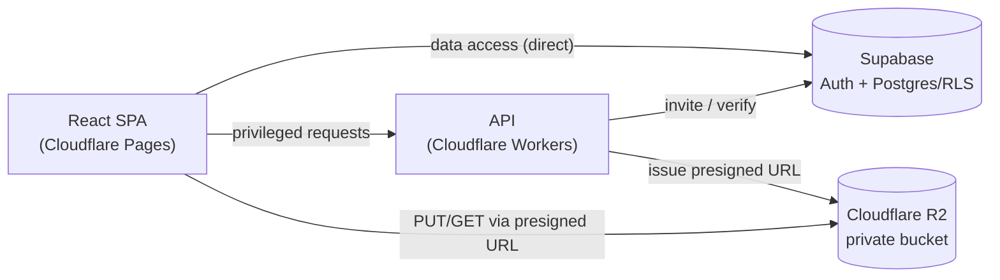
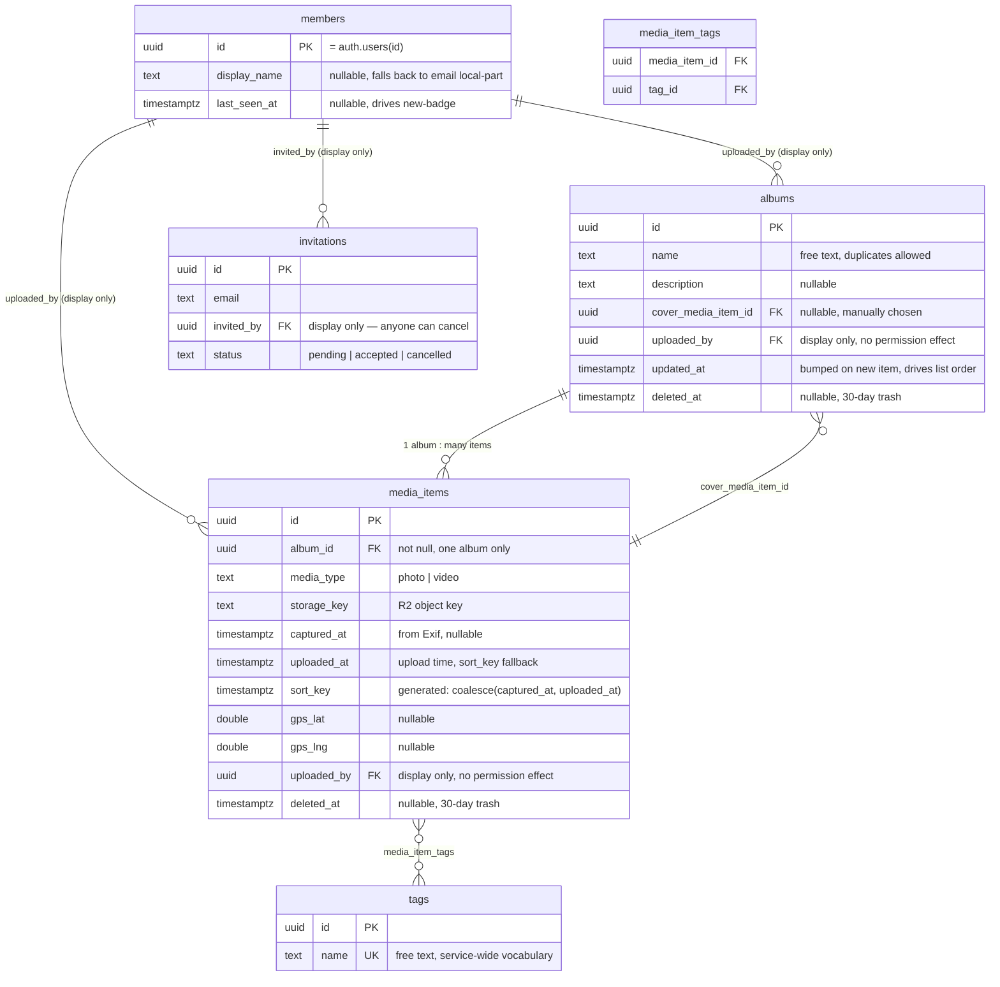

# amber

Capture the light, keep the moment.
Amber is a private space for sharing and preserving the photos that matter — with the people who matter. No public feeds, no algorithms. Just your moments, kept safe and shared only with those you invite.

## Tech Stack

- **Frontend**: React (Vite), fully client-rendered SPA — hosted on Cloudflare Pages, with a minimal PWA manifest + icons so it can be added to a phone's home screen (no Service Worker / offline caching)
- **API**: Cloudflare Workers — a thin layer limited to privileged operations (presigned URL issuance, sending invites)
- **Auth / DB**: Supabase (Postgres + Row Level Security) — accessed directly from the browser; RLS policies are the sole access-control boundary and are unit-tested with pgTAP
- **Storage**: Cloudflare R2 — private bucket, read/write only via short-lived presigned URLs (uploads and downloads both bypass Workers and go browser ↔ R2 directly)
- **Email**: Resend, wired as Supabase Auth's custom SMTP provider — used for the invite flow

### Architecture

## Access Control Model

Amber is single-tenant: one deployment serves exactly one shared group (e.g. one family). There's no workspace/organization concept in the data model — a person who wants a separate group (a different family, a friend group) runs their own instance. This is the root assumption behind "service-wide" everywhere below.

Amber uses a flat, service-level access control model — there is no per-album membership and no owner/admin role distinction.

- **Service-level invitations**: Invitations are sent from within an album (for a natural entry point in the UI), but the grant is service-wide — recipients get access to every album, not just the one the invite came from.
- **Flat permissions**: Every member can create, edit, or delete any album, photo, or video, and cancel any pending invitation, regardless of who created it. This keeps RLS policies simple — nearly every table's policy reduces to a single "is this user a service member?" check, with no ownership or role lookups.
- **No forced removal (MVP)**: A member can leave the service voluntarily, but no member can remove another. Revisit if abuse becomes a real problem post-MVP.
- **No "joined after" cutoff**: a newly invited member immediately sees every pre-existing album and photo — there's no history hidden based on when they joined, consistent with the service-wide grant being all-or-nothing.
- **Soft delete**: Because delete permission is fully flat (anyone can delete anyone's content), deleting an album, photo, or video moves it into a recoverable "trash" state for a 30-day retention window instead of purging immediately. The underlying R2 object is untouched during this window; only the DB reference is flagged, and permanent purge/restore follow the same flat permission rule.

## Authentication

- **Passwordless magic links** via Supabase Auth — no password storage or management.
- **Invite doubles as first login**: The invitation email uses Supabase Auth's invite flow, so clicking it both creates the account and logs the user in. Returning members request a fresh magic link with the same email address.
- **Link expiry**: uses Supabase Auth's default expiry, unconfigured — confirm the actual value in the dashboard at implementation time and revisit only if it proves too short in practice.
- **Display name**: optional profile field, not required at first login. Falls back to the local part of the email address until set. No avatar/profile picture in MVP — an initial or generated color badge is enough.
- **Unauthenticated screen**: a bare login screen (email input) — no marketing/landing page, since sign-up only ever happens via invite.

## MVP Feature Notes

- **Uploads**: restricted to common formats — photos as JPEG/PNG/HEIC (up to 20MB), videos as MP4/MOV (up to 500MB). Keeps thumbnail generation and Exif extraction predictable.
- **Tags**: free-text with autocomplete against existing tags, up to 5 per photo/video. Editing follows the same flat permission rule as deletes — any member can retag or remove a tag regardless of who added it.
- **Search**: tag-based filtering searches across the entire service, not scoped to a single album — matches the flat, service-wide access model. Selecting multiple tags is OR logic (any match shows the photo), not AND — avoids the common "zero results" trap of over-narrowing.
- **Downloads**: any member can download any photo/video at original quality via presigned URL.
- **Album cover**: manually selectable from any photo in the album by any member (same flat edit permission as everything else) — not auto-derived from the most recent upload.
- **Album ordering**: album list sorts by most-recently-updated (last photo added), not creation date.
- **Video previews**: grid view shows a static thumbnail (first frame) with a play icon overlay — no autoplay-on-hover.
- **Photo ordering**: within an album, photos default to oldest-capture-time-first (chronological, like a story) — capture time is read from Exif; photos without Exif (screenshots, edited exports) fall back to upload time so they still sort in naturally rather than being segregated.
- **Pagination**: infinite scroll (cursor-based) within an album, not paged "next" buttons.
- **Photo detail view**: each photo/video has its own URL (a route, not a modal), so a specific item can be shared or bookmarked directly. Left/right arrow keys and swipe navigate to the previous/next photo in the same album's sort order, updating the URL as you go.
- **Upload resilience**: each file in a multi-file upload is tracked independently — one file failing (dropped connection, expired presigned URL) doesn't block the others. Failed files retry automatically a few times, then surface to the user for manual retry.
- **Photo-album relationship**: each photo/video belongs to exactly one album (one-to-many, not many-to-many) — keeps delete/tag/move operations unambiguous and avoids a join table.
- **Album names**: free text, no uniqueness constraint — duplicate names (e.g. recurring "Hanami" albums across years) are expected and fine.
- **Album description**: optional free-text caption per album, editable under the same flat permission rule as everything else.
- **No storage cap**: no limit on total upload volume across the service — R2 storage is cheap enough at this scale (one family/friend group) that usage-based cost monitoring is deferred until it's actually a concern, rather than building quota tracking upfront.
- Exif GPS metadata (lat/lng/altitude) is captured into the schema at upload time for future use, even though no MVP feature consumes it yet. Downloads serve the original file unmodified — GPS data is not stripped server-side, matching the direct browser↔R2 download model; members are trusted with how they re-share downloaded files outside the app.
- **"New since last visit"**: with no push/email notifications, each member's last-seen timestamp is tracked so photos/albums added since then get a "new" badge — the minimum-effort substitute for a notification system.

## Data Model

### Design notes

- **`media_items` holds both photos and videos** (`media_type` discriminator), not separate `photos`/`videos` tables. Every feature decision above (tagging, delete permission, album membership, sort order, search) treats photos and videos identically — splitting the table would mean duplicating RLS policies and queries for no product-level benefit. The name is deliberately not `photos`, to avoid implying photo-only.
- **One album per item**: `media_items.album_id` is `not null` with no join table — matches the one-to-many decision (an item can't live in two albums).
- **Soft-delete cascade without touching child rows**: deleting an album does *not* bulk-update every `media_item.deleted_at`. Visibility is the compound condition `album.deleted_at IS NULL AND media_item.deleted_at IS NULL`. This means restoring an album brings back all its items automatically, except ones that were individually deleted before the album was — matching "album delete cascades to contents" without an item-count-dependent trigger.
- **`sort_key` is a generated column** (`coalesce(captured_at, uploaded_at)`), indexed together with `album_id` — the Exif-first, upload-time-fallback photo ordering is then just `ORDER BY sort_key`.
- **`media_item_tags` enforces the 5-tag cap via trigger**, not a check constraint (Postgres can't `CHECK` against a sibling table's row count directly).
- **`uploaded_by` / `invited_by` are display-only foreign keys** — they never appear in an RLS policy's `USING`/`WITH CHECK` clause. Permission is always "is this user a member," never "is this user the creator."
- **RLS is a single `is_member()` helper function**, reused via `USING (public.is_member())` on every table — the direct implementation of the flat permission model described in "Access Control Model" above.
- **No `workspace_id` / tenant column anywhere** — consistent with the single-tenant decision; a separate group means a separate deployment, not a row-level partition.

### Out of Scope for MVP

- Comments or reactions on photos/videos.
- Avatar/profile picture uploads.
- Multi-tenant workspaces — Amber is single-tenant by design (see Access Control Model above), not a deferred feature.
- Upload notifications (email or push) beyond the invite email itself — members check the app to see what's new.
- Duplicate-upload detection (file hashing/matching) — accidental double-uploads are cleaned up manually like any other unwanted photo.
- Bulk/ZIP downloads — single-file downloads only.
