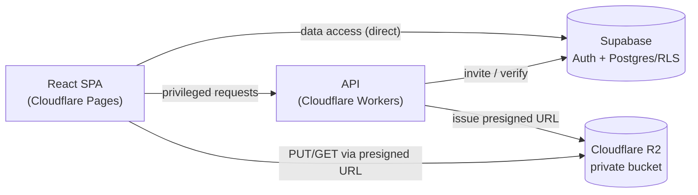
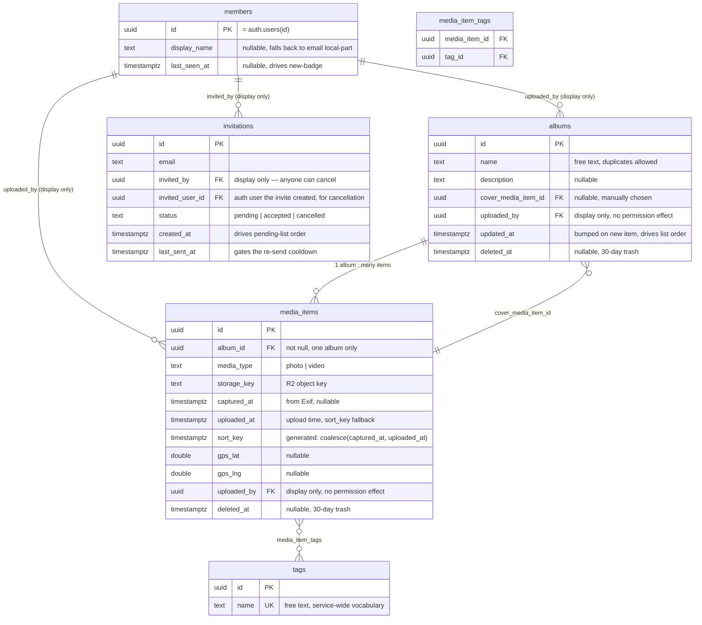

  

# amber

Capture the light, keep the moment.
Amber is a private space for sharing and preserving the photos that matter — with the people who matter. No public feeds, no algorithms. Just your moments, kept safe and shared only with those you invite.

## Tech Stack

- **Frontend**: React (Vite), fully client-rendered SPA — hosted on Cloudflare Pages, with a minimal PWA manifest + icons so it can be added to a phone's home screen (no Service Worker / offline caching)
- **API**: Cloudflare Workers — a thin layer limited to privileged operations (presigned URL issuance, sending invites)
- **Auth / DB**: Supabase (Postgres + Row Level Security) — accessed directly from the browser; RLS policies are the sole access-control boundary and are unit-tested with pgTAP
- **Storage**: Cloudflare R2 — private bucket, read/write only via short-lived presigned URLs (uploads and downloads both bypass Workers and go browser ↔ R2 directly)
- **Email**: Resend, wired as Supabase Auth's custom SMTP provider — used for the invite flow

### Architecture

```mermaid
flowchart LR
    SPA["React SPA<br/>(Cloudflare Pages)"]
    API["API<br/>(Cloudflare Workers)"]
    SB[("Supabase<br/>Auth + Postgres/RLS")]
    R2[("Cloudflare R2<br/>private bucket")]

    SPA -- "data access (direct)" --> SB
    SPA -- "privileged requests" --> API
    API -- "invite / verify" --> SB
    API -- "issue presigned URL" --> R2
    SPA -- "PUT/GET via presigned URL" --> R2
```

## Local Development

- `pnpm install`, then `pnpm supabase:start` (requires Docker/OrbStack running) to boot the local Supabase stack.
- `apps/web` needs a `.env.local` (see `apps/web/.env.example`) with the local Supabase URL and publishable key — both printed by `pnpm supabase:status`.
- `pnpm dev` starts `apps/web` and `apps/api` together with labeled, colored output; `dev:web` / `dev:api` run them individually.
- `apps/api` needs a `.dev.vars` (see `apps/api/.dev.vars.example`). `SUPABASE_SERVICE_ROLE_KEY` comes from `pnpm supabase:status` — the Worker uses it to send and cancel invitations, which are the only operations in Amber that bypass RLS. The R2 credentials in the same file are covered under "R2 setup" below.
- Invite emails are not delivered anywhere in local development — the Supabase stack captures them in Mailpit at http://127.0.0.1:54324, which is where the invite link can be picked up to test the flow end to end.
- **Agent skills**: `.agents/skills.json` declares the Cloudflare skills that AI coding agents load for this repo; `pnpm skills:install` installs them via `gh skill` and prunes anything no longer declared. The skills themselves land in `.agents/skills/`, which is gitignored — the manifest is the source of truth, so add or remove a skill by editing it rather than by installing ad hoc. Append `@<tag-or-sha>` to a skill name to pin it. `pnpm skills:update` pulls upstream changes, `pnpm skills:list` shows each skill's tracked source and version. Source tracking lives in each `SKILL.md` frontmatter, so installing outside `gh skill` leaves a skill untracked and `skills:update` will skip it. `.claude/skills` is a symlink to `.agents/skills`, so Claude Code and the `.agents`-based agents share one copy.
- **R2 setup (one-time)**: after creating a Cloudflare account and adding an R2 subscription (free tier covers MVP usage), run `CLOUDFLARE_ACCOUNT_ID=<your-account-id> pnpm setup:r2` to create the `amber-media` bucket, apply its CORS policy, and write `R2_ACCOUNT_ID` into `apps/api/.dev.vars`. It's kept out of `wrangler.jsonc` (and out of git) since this repo is public and an account ID identifies you personally, even though it isn't a credential. R2 API tokens can't be created via CLI — create one in the dashboard (R2 > Manage R2 API Tokens, Object Read & Write, scoped to the bucket) and add the Access Key ID / Secret Access Key to `apps/api/.dev.vars` too. In production, all three (`R2_ACCOUNT_ID`, `R2_ACCESS_KEY_ID`, `R2_SECRET_ACCESS_KEY`) are set via `wrangler secret put`, not `wrangler.jsonc`.

## Tests

- `pnpm test` runs the `apps/api` suite, `pnpm test:watch` keeps it running, and `pnpm typecheck` type-checks every workspace package — including the test project, which `vitest` itself does not do.
- The suite runs on the real Workers runtime through `@cloudflare/vitest-pool-workers`, so a request passes through the actual router, CORS wrapper and JWT verification rather than a stand-in. Authentication is exercised end to end: `mockNetwork()` generates a key pair, serves it as the JWKS the Worker fetches, and `authedRequest()` signs a real token against it.
- Test bindings come from the `miniflare.bindings` block in `apps/api/vitest.config.mts`, not from `.dev.vars`, so a clone with no local Supabase or R2 can still run the suite and no test can reach a real project. `test/helpers.ts` asserts this during setup rather than trusting it.
- Outbound calls are declared per test with `fetchMock`, and the network is closed otherwise (`disableNetConnect`). That is what gives the negative cases teeth: a call no test declared — revoking an auth account that should have been left alone — fails instead of quietly going out.
- Every interceptor a test declares has to be used. `endOfTest`, the shared `afterEach`, checks that and then clears them, so an unused one reports the call the Worker was supposed to make and did not, without cascading into the tests that follow.

## Deployment

### One-time prerequisites

- A production Supabase project (separate from local dev), with `supabase/migrations` applied (`supabase db push` against the linked project) and Resend configured as the custom SMTP provider for magic-link email (see "Authentication" above).
- Cloudflare R2 set up per the "R2 setup" step above — the same bucket serves both local dev and production, so this isn't a separate step per environment.
- A decision on the production frontend URL (a `*.pages.dev` subdomain is fine to start; a custom domain can be attached later without changing the steps below).

### Deploying the API (Cloudflare Workers)

1. In `apps/api/wrangler.jsonc`, update the `vars` block for production: `SUPABASE_URL` (the production project's URL) and `ALLOWED_ORIGIN` (the production frontend URL from above).
2. Run `pnpm wrangler deploy`. This has to happen *before* secrets can be set — Cloudflare rejects `wrangler secret put` against a Worker that's never been deployed.
3. Set the three R2 credentials as secrets (never as `vars` — see the "R2 setup" note above for why): `pnpm wrangler secret put R2_ACCOUNT_ID`, `pnpm wrangler secret put R2_ACCESS_KEY_ID`, `pnpm wrangler secret put R2_SECRET_ACCESS_KEY`.
4. Set the production project's service role key the same way: `pnpm wrangler secret put SUPABASE_SERVICE_ROLE_KEY` (Supabase dashboard, Project Settings > API). This key bypasses RLS entirely, so it belongs in secrets and never in `wrangler.jsonc` or the frontend bundle.
5. Note the deployed Worker's URL (`https://api.<subdomain>.workers.dev` unless a custom domain is attached) — the web app needs it next.

### Deploying the web app (Cloudflare Pages)

1. Set the production build-time env vars (`apps/web/.env.production`, or exported in the shell before building): `VITE_SUPABASE_URL` / `VITE_SUPABASE_ANON_KEY` for the production Supabase project, and `VITE_API_URL` set to the Worker URL from the previous step. Vite bakes these in at build time — a static `wrangler pages deploy` doesn't run the build or manage them.
2. `pnpm --filter web build`
3. First deploy only: `pnpm --filter web exec wrangler pages project create` (prompts for a project name and production branch).
4. `pnpm --filter web exec wrangler pages deploy dist`

### Closing the loop

The frontend's real URL (`https://<project>.pages.dev`, or a custom domain) is only known after the first Pages deploy, which creates a chicken-and-egg with step 1 of the API deploy (`ALLOWED_ORIGIN`). Expect one extra round-trip on the very first deploy: after the Pages URL exists, go back and update `ALLOWED_ORIGIN` in `wrangler.jsonc`, redeploy the API (`pnpm wrangler deploy`), and add the same origin to the R2 bucket's CORS policy (re-run `pnpm setup:r2` with `ALLOWED_ORIGINS` set to both the local and production origins, comma-separated). Deciding a custom domain upfront avoids this extra pass on future projects, but isn't required to ship.

## Access Control Model

Amber is single-tenant: one deployment serves exactly one shared group (e.g. one family). There's no workspace/organization concept in the data model — a person who wants a separate group (a different family, a friend group) runs their own instance. This is the root assumption behind "service-wide" everywhere below.

Amber uses a flat, service-level access control model — there is no per-album membership and no owner/admin role distinction.

- **Service-level invitations**: Sending an invitation grants service-wide access — the recipient gets every album, not a subset. Invitations are managed from one dialog on the album list screen (send, review who hasn't arrived, cancel), matching the fact that the grant is service-wide rather than scoped to wherever the invite was sent from.
- **The invite is the grant; acceptance is not a gate**: Supabase Auth's invite creates the `auth.users` row the moment the invitation is sent, so the recipient can sign in from the normal login screen without ever opening the invite email. The `invitations` table is a ledger for showing who hasn't arrived yet — it is never consulted for access control. Cancelling an invitation therefore deletes the underlying auth user; flipping the row's status alone would leave the recipient able to log in at will.
- **Flat permissions**: Every member can create, edit, or delete any album, photo, or video, and cancel any pending invitation, regardless of who created it. This keeps RLS policies simple — nearly every table's policy reduces to a single "is this user a service member?" check, with no ownership or role lookups.
- **No forced removal (MVP)**: A member can leave the service voluntarily, but no member can remove another. Revisit if abuse becomes a real problem post-MVP.
- **No "joined after" cutoff**: a newly invited member immediately sees every pre-existing album and photo — there's no history hidden based on when they joined, consistent with the service-wide grant being all-or-nothing.
- **Soft delete**: Because delete permission is fully flat (anyone can delete anyone's content), deleting an album, photo, or video moves it into a recoverable "trash" state instead of purging immediately. Only the DB reference is flagged; the R2 object is left alone. Restoring follows the same flat permission rule as deleting. Nothing currently removes anything for good — see "Out of Scope for MVP" for what the retention window is waiting on.

  Deleting an album asks first; deleting a single photo does not. Both are undoable, so the difference is reach rather than permanence: an album takes everything inside it out of view at once, and the member doing it may not remember how much that is. The dialog says how many, which is the one place a count query is worth running — the grid deliberately never counts, but that is because it pages on every scroll, and a confirmation happens once. A photo is one item, visible on screen at the moment it is deleted, and photos get tidied several at a time; a prompt on each would be in the way. The trash shows a thumbnail for every photo in it, since "which one was that" is the question a list of album names cannot answer.

## Authentication

- **Passwordless magic links** via Supabase Auth — no password storage or management.
- **Invite doubles as first login**: The invitation email uses Supabase Auth's invite flow, so clicking it both creates the account and logs the user in. Returning members request a fresh magic link with the same email address.
- **Membership starts at first login**: the `public.members` row is created when an address is first confirmed, not when the invitation is sent, so an invited-but-never-arrived person owns no rows anywhere. This is a bookkeeping boundary rather than a security one — the auth user exists from the moment of the invite (see "Access Control Model"), so cancelling is the only way to take the grant back.
- **Confirmation is looser than it sounds**: Supabase Auth treats an invited address as confirmed as soon as a login link is *requested* for it, without waiting for anyone to open that link. Opening the invite link has the same effect, including when a mail scanner or link prefetcher opens it on the recipient's behalf. Neither path leaks access — logging in still requires receiving the email — but it does mean "confirmed" reads as "a login was started for this address", and nothing more.
- **Link expiry**: uses Supabase Auth's default expiry (`otp_expiry`, one hour locally). Expiry applies to the emailed link, never to the account, so a member who has logged in at least once can always ask for a fresh link however long they stay away. Someone still on their first, unopened invitation cannot — see the re-sending note below.
- **Display name**: optional profile field, not required at first login. Falls back to the local part of the email address until set. No avatar/profile picture in MVP — an initial or generated color badge is enough.
- **Unauthenticated screen**: a bare login screen (email input) — no marketing/landing page, since sign-up only ever happens via invite.
- **Self-signup is disabled at the provider** (`[auth] enable_signup = false`, and the same switch on the production project). The login screen asking for a link rather than an account is not what enforces invite-only: the anon key ships in the frontend bundle, so `/auth/v1/signup` is callable by hand, and an account created that way arrives already confirmed — which is exactly the state that enrols a member. Note that `[auth.email] enable_signup` is a different switch despite the name; the CLI maps it onto whether the email provider works at all, so turning it off disables magic-link login outright.
- **An invitation that goes unopened past its expiry needs re-sending.** With self-signup off, Supabase Auth answers a magic-link request for an unconfirmed address with `signup_disabled`, so a recipient whose invite link expired cannot help themselves from the login screen. Someone already inside re-sends it for them, from the same dialog the invitation was sent from.

### Invite flow

Sending and cancelling both need Supabase's service role key, so both live in the Worker rather than in the browser. Reading the invitation list does not, so the album list screen queries `invitations` directly through RLS like any other table.

- `POST /invitations` — verifies the caller's JWT, rejects an address that is already a member or already has a pending invitation (409), calls Supabase Auth's invite endpoint, then records the row with `invited_by` set to the caller and `invited_user_id` set to the auth user the invite just created.
- `POST /invitations/:id/resend` — re-sends the email for an invitation that is still `pending`, at most once a minute per invitation. Supabase Auth hands back the same unconfirmed user rather than creating another, so only a fresh link goes out. Offered because the invite link expires long before the invitation does, and with self-signup off the recipient has no way to ask for one themselves. The cooldown is there because Supabase Auth's hourly mail budget is shared with magic-link login: burning it through re-sends would stop existing members from logging in, and under the flat permission model any member can hold the button down. A minute is aimed at repeat clicking rather than at a determined member, who already has delete rights over everything in the service.
- `DELETE /invitations/:id` — deletes that auth user, then marks the row `cancelled`. The order matters: the row is the only pointer to the auth user, so flipping the status first would strand the account with access intact if the delete then failed.

A cancelled address can be invited again — deleting the auth user releases the address, and the partial unique index only constrains rows still `pending`.

Status moves `pending → accepted` from a database trigger on first email confirmation, not from application code. Every way in funnels through the same column (`auth.users.email_confirmed_at`), so the trigger is the one place that observes them all.

Cancellation is only offered while an invitation is `pending`, which keeps it clear of the "no forced removal" rule in "Access Control Model" — cancelling withdraws an invitation nobody has taken up, rather than ejecting a member. The cost is that the window can close on its own: because a login link merely being requested counts as confirmation, a mis-sent invitation can reach `accepted` before anyone notices it went to the wrong address, and there is then no way to withdraw it. Reopening that door means deciding when one member may remove another, which MVP deliberately leaves alone.

## MVP Feature Notes

- **Uploads**: restricted to common formats — photos as JPEG/PNG/HEIC (up to 20MB), videos as MP4/MOV (up to 500MB). Keeps thumbnail generation and Exif extraction predictable.
- **Tags**: free-text with autocomplete against existing tags, up to 5 per photo/video. Editing follows the same flat permission rule as deletes — any member can retag or remove a tag regardless of who added it. Tagging happens in the photo's own detail view, beside the capture time, on the same reasoning as album covers: an operation on one photo belongs where that photo is. The tags ride along on the query that loads the album's items rather than being fetched per photo, for the same reason the uploader does — stepping through with the arrow keys shouldn't make them arrive late. The cap is enforced in both places: the input stops accepting once a photo has five, and the database trigger stays as the last word, since another tab can always be a step behind. A name is trimmed before it is stored and matched against the existing vocabulary case-insensitively, so "BBQ" typed again as "bbq" reuses the tag instead of sitting beside it. `tags.name` is a plain unique index rather than a `lower(name)` one, so that last part is the client keeping the vocabulary tidy rather than the database enforcing it — worth revisiting if the two ever disagree in practice.
- **Search**: tag-based filtering searches across the entire service, not scoped to a single album — matches the flat, service-wide access model. Selecting multiple tags is OR logic (any match shows the photo), not AND — avoids the common "zero results" trap of over-narrowing. It gets its own route (`/search`) rather than a mode the album list drops into, since a result set spanning albums has no album to belong to, and the selected tags live in the URL (`/search?tags=家族&tags=旅行`) so a search can be shared or bookmarked the way a photo can. The parameter repeats rather than joining on a comma, because a tag is free text and may contain one — a joined list would then tear that tag in half on the way back out. The URL names the tags rather than identifying them by uuid, and so does the query behind it, which leaves nothing to resolve on the way in. Opening a photo from the results keeps the results as its context: the arrows step to the next match rather than to the next photo in whichever album that one happens to live in, and closing returns to the search rather than to that album. The tag list offers the whole vocabulary as toggles rather than an input to type into — seeing what tags exist is itself the way in, at the scale one household produces.
- **Downloads**: any member can download any photo/video at original quality via presigned URL, straight from the browser to R2 like uploads. Sending a filename is what asks for a download — there is no separate flag, since a download is exactly the case that needs a name. It adds `response-content-disposition` to the signature, which is what makes the browser save the file instead of navigating to it; an `<a download>` is ignored cross-origin. The name is rebuilt server-side from a strict character allowlist and the stored object's own extension, since it lands inside a signed header.
- **Album cover**: manually selectable from any photo in the album by any member (same flat edit permission as everything else) — not auto-derived from the most recent upload. Chosen from the photo's own detail view, and shown as a thumbnail in the album list. Videos are not offered, since the grid has no frame to show for them yet; that button stays disabled and says why rather than greying out unexplained. The icon is a book carrying a picture rather than a star: a star reads as "favourite" everywhere else on the web, and this writes the album's cover. A cover can outlive the photo it points at: soft-deleting an item only flags the row, so the FK's `on delete set null` never fires and the album goes on referencing something nobody should see — every reader has to check the cover's own `deleted_at`.
- **Album ordering**: album list sorts by most-recently-updated (last photo added), not creation date.
- **Video previews**: grid view shows a static thumbnail (first frame) with a play icon overlay — no autoplay-on-hover. The frame is taken in the browser at upload time, drawn to a canvas and stored as a second R2 object beside the video, which keeps the grid to one `` per cell rather than a wall of `<video>` elements a phone would have to hold open at once. It is deliberately best-effort: a browser that cannot decode the codec produces nothing, the video still uploads, and the cell falls back to the placeholder it used before. That case is real rather than theoretical — an iPhone's `.MOV` is usually HEVC, which Safari decodes and desktop Chrome generally does not. Nothing in the Worker changes: asking it to sign a `image/jpeg` upload returns a `.jpg` key the same way any photo would.
- **Photo ordering**: within an album, photos default to oldest-capture-time-first (chronological, like a story) — capture time is read from Exif; photos without Exif (screenshots, edited exports) fall back to upload time so they still sort in naturally rather than being segregated.
- **Pagination**: infinite scroll within an album, not paged "next" buttons. The cursor is the pair `(sort_key, id)`, never `sort_key` alone: it is `coalesce(captured_at, uploaded_at)` and Exif capture time only has second precision, so a burst of shots shares one value — paging on it alone either skips the rest of a tied group (`gt`) or returns it forever (`gte`). PostgREST has no row comparison, so the pair is spelled out as `sort_key.gt.X,and(sort_key.eq.X,id.gt.Y)`. A short page is the only end-of-list signal; there is no count query.
- **Photo detail paging**: the detail view holds the current item and one neighbour on each side rather than the whole album, fetched with the same cursor running backwards (`lt` + descending) and forwards. The route is bookmarkable, so it can be opened at the five hundredth photo without the grid ever having been visited — loading the album to find an index would make that the slowest way in. Items already fetched are kept, so stepping onto a neighbour shows it immediately and only the new neighbours are fetched. This is also why there is no "3 / 9" counter: knowing the position means counting everything before it, on every step.
- **Photo detail view**: each photo/video has its own URL (`/albums/:albumId/items/:mediaItemId` — a route, not a modal), so a specific item can be shared or bookmarked directly. Left/right arrow keys and swipe navigate to the previous/next item in the same album's sort order, updating the URL as you go; stepping stops at both ends rather than wrapping. The viewer is full-bleed and dark, deliberately unlike the light chrome everywhere else — it is the one screen whose job is to get out of the photo's way. Escape returns to the album.
- **Photo detail footer**: the metadata sits on a bar of its own — a top border and a lighter fill, separating it from the photo above rather than floating as grey text on the same black, where it read as something left over in the margin. Both timestamps are labelled and both are always shown, because `sort_key` is `coalesce(captured_at, uploaded_at)` and one unlabelled date therefore means either without saying which — nothing in the picture tells a reader apart a photo taken in May from one uploaded in May. A file carrying no Exif capture time reads "撮影 不明" rather than quietly borrowing the upload time in its place. The two rows are a two-column list, left-aligned and set in tabular figures so the dates stack into a column; centring them would leave the values ragged, since "撮影" and "アップロード" are different widths. Tags are pills with an inset ring rather than fill alone: `bg-white/10` over the viewer's near-black lands close enough to the backdrop that a row of tags read as loose grey words instead of chips. The photo itself is the only part that gives up height — the header and footer hold their size, and the image is bounded by the space left between them, with padding so it stops short of both rather than butting against them. The bar spans the window but its contents sit in the same `max-w-2xl` container the album list, album detail, search and trash all use: full-bleed, the metadata strands itself against the left edge of a wide monitor, far from the photo it describes. Aligning it to the photo's own edge instead was rejected because that edge moves — a portrait and a landscape shot put it in different places, so arrowing through an album would slide the footer back and forth.
- **Upload resilience**: each file in a multi-file upload is tracked independently — one file failing (dropped connection, expired presigned URL) doesn't block the others. Three run at a time rather than all at once, which is sized for a phone on mobile data where a hundred parallel PUTs would starve each other. A failure that waiting could fix (dropped connection, 5xx, 429) retries automatically twice, backing off 1s then 2s; one that it can't (unsupported type, over the size limit) fails immediately instead of making the member sit through three attempts. What is left after that surfaces in the tray for manual retry, which resets the attempt count since it is the member asking again rather than the backoff carrying on.
- **Upload retries resume rather than restart**: an upload is three steps — presign, PUT to R2, then the `media_items` row. A retry after the PUT already succeeded writes only the row, reusing the object in R2. Starting over would upload a second copy and leave the first one referenced by nothing, and nothing purges R2 (permanent delete is out of scope). A failed PUT does start over, since a signed URL only lasts an hour and the refusal can be the signature itself. A stop that lands after the PUT finished is treated the same way: the row is not written, so the tray never claims a cancel while the photo shows up in the album regardless. What that leaves in R2 is an object no row points at — retrying the file adopts it, and otherwise it waits for the same permanent-delete sweep as any other unreferenced object.
- **Upload progress**: byte-level, both per file and for the batch, in a tray pinned to the bottom of the album screen so it stays visible while scrolling the grid. Videos run to 500MB, and a file-level "sending…" would look frozen for minutes. This is why the PUT uses `XMLHttpRequest` rather than `fetch`, which has no upload-progress event — the request-body stream that would replace it is unsupported in Safari, and Amber is used from iPhones. Uploading is tied to the album screen: leaving it stops the transfers rather than continuing invisibly.
- **Uploader**: shown in the photo detail footer as `by <name>`, beside the upload time rather than the capture time — the upload is the event they were present for. It rides along on the query that loads the album's items rather than being fetched per photo, so stepping through with the arrow keys doesn't make the name arrive late. Three states have to be told apart: a name, a member who never set one (`display_name` is null), and a photo whose uploader is gone — `uploaded_by` is `on delete set null`, so a photo outlives the member who added it. The last one reads as "削除されたメンバー" rather than as an unnamed member, since those are different facts.
- **Display name**: edited from the header on the album list, which doubles as where the current member is shown. `members_select` already opens the roster to every member and `members_update_self` restricts writes to your own row, so the permission model needed nothing new — only a field. Saving trims the input and stores an empty result as null, keeping "unset" a single state instead of two the readers would each have to test for. Once a name is set it cannot be emptied again, only changed: the uploader footer reads `display_name` live rather than from a copy taken at upload time, so clearing it renames every photo that member has ever added to "unnamed" at once. Changing the name is the same person being called something else and needs no such guard. A member who has never set one is free to leave it empty, since there is nothing to undo.
- **Photo-album relationship**: each photo/video belongs to exactly one album (one-to-many, not many-to-many) — keeps delete/tag/move operations unambiguous and avoids a join table.
- **Album names**: free text, no uniqueness constraint — duplicate names (e.g. recurring "Hanami" albums across years) are expected and fine.
- **Album description**: optional free-text caption per album, editable under the same flat permission rule as everything else.
- **No storage cap**: no limit on total upload volume across the service — R2 storage is cheap enough at this scale (one family/friend group) that usage-based cost monitoring is deferred until it's actually a concern, rather than building quota tracking upfront.
- Exif GPS metadata (lat/lng/altitude) is captured into the schema at upload time for future use, even though no MVP feature consumes it yet. Downloads serve the original file unmodified — GPS data is not stripped server-side, matching the direct browser↔R2 download model; members are trusted with how they re-share downloaded files outside the app.
- **"New since last visit"**: with no push/email notifications, each member's last-seen timestamp is tracked so albums added to since then get a "new" badge — the minimum-effort substitute for a notification system. The badge sits on the album list only, where it answers "is there anything to go and look at"; a per-photo marker inside the album would need a second timestamp to mean anything, since the one on `members` is service-wide. Arriving reads the previous timestamp, keeps it as the session's reference point, and writes the current time straight back — so the badges stay up for as long as that visit lasts and are gone on the next one. Reloading the page takes a fresh reference and therefore clears them, which is the cost of keeping the whole mechanism to one column. A member who has never been seen before gets no badges at all: on a first visit everything is new, so marking it says nothing.
- **Theme**: light, dark, or follow the device, chosen from the member's own menu. It is kept in `localStorage` rather than on the `members` row, because it describes the screen being read from rather than the person reading — the same member on a phone at night and a laptop by day wants different answers. The class is applied by a small script in the document head, ahead of the bundle, so a reader on the dark theme never gets a white frame first; React applies the same class again on mount, which is what makes the switch take effect. Choosing "follow the device" keeps listening after load, since a tab left open through dusk should turn with the machine. The photo viewer stays dark under every setting — it is the one screen whose job is to get out of the photo's way.

## Brand

The mark is a hexagon drawn as **three separate arcs** around a **smaller hexagon of the same shape**, with the top arc in a contrasting colour. Each part carries one of the ideas in "Capture the light, keep the moment":

- **The core repeats the outer shape** — amber keeps what it holds in the form it went in. Preserving, not just storing.
- **The enclosure is made of several pieces, not one line** — the space exists because people gather to make it. The gaps between them are where someone new is let in, which is what an invite-only service needs to leave room for.
- **One arc is a different colour** — the people who gather are not interchangeable. Permissions are flat, but the members are not identical.

Two colours per theme, chosen so the mark never depends on the UI's own palette: amber `#B87514` on light / `#F0B04A` on dark, with the accent arc in turquoise `#0CA678` / `#2DD4A7`. Turquoise sits opposite amber on the wheel, which is what keeps the accent readable when the mark is scaled down to a 16px favicon — a warmer accent collapses back into the amber at that size.

`favicon.svg` carries both palettes in one file via `prefers-color-scheme`, so the tab icon follows the browser theme. Every colour is also set as an attribute, so a renderer that ignores the stylesheet still gets the light palette rather than black. An SVG is XML, which fails harder than HTML: a malformed one is still served with a 200 and the right content-type, and simply never renders, so the only symptom is that the icon never changes. `pnpm check:svg` guards the cases that cause it (a double hyphen inside a comment, a bare ampersand, an unclosed tag) and runs as part of the web build. The PNGs for the manifest cannot do that — a manifest icon is one fixed image — so they are rendered on the dark background `#14110E`, which is also the manifest's `theme_color` and `background_color`. Amber reads as something that glows in the dark, and a dark tile holds its edge against any wallpaper where a white one would dissolve. The maskable icon keeps the mark inside the middle 80%, since Android crops it to a circle or a squircle depending on the launcher.

## Data Model

```mermaid
erDiagram
    members ||--o{ albums : "uploaded_by (display only)"
    members ||--o{ media_items : "uploaded_by (display only)"
    members ||--o{ invitations : "invited_by (display only)"
    albums ||--o{ media_items : "1 album : many items"
    albums }o--|| media_items : "cover_media_item_id"
    media_items }o--o{ tags : "media_item_tags"

    members {
        uuid id PK "= auth.users(id)"
        text display_name "nullable, falls back to email local-part"
        timestamptz last_seen_at "nullable, drives new-badge"
    }
    albums {
        uuid id PK
        text name "free text, duplicates allowed"
        text description "nullable"
        uuid cover_media_item_id FK "nullable, manually chosen"
        uuid uploaded_by FK "display only, no permission effect"
        timestamptz updated_at "bumped on new item, drives list order"
        timestamptz deleted_at "nullable, 30-day trash"
    }
    media_items {
        uuid id PK
        uuid album_id FK "not null, one album only"
        text media_type "photo | video"
        text storage_key "R2 object key"
        timestamptz captured_at "from Exif, nullable"
        timestamptz uploaded_at "upload time, sort_key fallback"
        timestamptz sort_key "generated: coalesce(captured_at, uploaded_at)"
        double gps_lat "nullable"
        double gps_lng "nullable"
        uuid uploaded_by FK "display only, no permission effect"
        timestamptz deleted_at "nullable, 30-day trash"
    }
    tags {
        uuid id PK
        text name UK "free text, service-wide vocabulary"
    }
    media_item_tags {
        uuid media_item_id FK
        uuid tag_id FK
    }
    invitations {
        uuid id PK
        text email
        uuid invited_by FK "display only — anyone can cancel"
        uuid invited_user_id FK "auth user the invite created, for cancellation"
        text status "pending | accepted | cancelled"
        timestamptz created_at "drives pending-list order"
        timestamptz last_sent_at "gates the re-send cooldown"
    }
```

### Design notes

- **`media_items` holds both photos and videos** (`media_type` discriminator), not separate `photos`/`videos` tables. Every feature decision above (tagging, delete permission, album membership, sort order, search) treats photos and videos identically — splitting the table would mean duplicating RLS policies and queries for no product-level benefit. The name is deliberately not `photos`, to avoid implying photo-only.
- **One album per item**: `media_items.album_id` is `not null` with no join table — matches the one-to-many decision (an item can't live in two albums).
- **Soft-delete cascade without touching child rows**: deleting an album does *not* bulk-update every `media_item.deleted_at`. Visibility is the compound condition `album.deleted_at IS NULL AND media_item.deleted_at IS NULL`. This means restoring an album brings back all its items automatically, except ones that were individually deleted before the album was — matching "album delete cascades to contents" without an item-count-dependent trigger. It also shapes the trash, which lists albums and individually-deleted items as two separate groups: an album's contents have no rows of their own to show, and restoring the album is what brings them back.
- **`sort_key` is a generated column** (`coalesce(captured_at, uploaded_at)`), indexed together with `album_id` — the Exif-first, upload-time-fallback photo ordering is then just `ORDER BY sort_key`.
- **`sort_key` is not a total order, so every listing breaks ties on `id`.** Exif capture time only has second precision and burst shots share one, and SQL gives equal keys no guaranteed relative order. The grid and the detail view are separate queries over the same album, and the detail view derives "previous", "next", and "n of m" from its own copy — let the two disagree on a tied pair and a thumbnail opens its neighbour. Any new listing of an album's items has to carry the same tiebreaker.
- **`media_item_tags` enforces the 5-tag cap via trigger**, not a check constraint (Postgres can't `CHECK` against a sibling table's row count directly).
- **A tag is created with an upsert rather than a lookup followed by an insert.** `tags.name` is unique service-wide, so two members tagging two different photos "花見" in the same moment race, and the loser of that race gets a 23505 for a tag that now exists. `on conflict (name) do update` hands back the existing row instead, which is both race-proof and one round trip rather than two. The `do update` is a no-op on a table of `(id, name)` — it is there because `do nothing` returns no row, and the caller needs the id to link the photo to it.
- **Tag search is a database function, not a PostgREST query.** The OR is a join to `media_item_tags`, so a photo carrying two of the selected tags comes back twice, and duplicate rows break the page size, the `(sort_key, id)` cursor and the short-page end-of-list signal all at once — PostgREST has no `DISTINCT` to undo it with. An `EXISTS` predicate never duplicates in the first place. The function is also where the cursor can be written as the row comparison `(sort_key, id) > (…)` that PostgREST lacks, instead of being spelled out as `or=(…,and(…))`. It returns `setof media_items`, which is what lets a caller go on embedding the uploader and the tags exactly as the album grid does. It stays `security invoker`, so the caller's own RLS is still what limits it to members — `security definer` would hand every caller the whole table.
- **`albums.updated_at` is bumped by a trigger on `media_items`, not by the uploader.** Two features read it — the album list's ordering and the new-since-last-visit badge — and both are silently wrong if a write path forgets to touch it. A trigger moves the column however the row arrives, including from a future importer or a fix applied by hand. It fires on insert only: a delete is a change to the album but not something to call new, and bumping there would light the badge for a photo that just disappeared.
- **A video thumbnail is sized by its short edge, not its long one, and keeps the video's aspect ratio.** The grid draws every cell as a square with `object-cover`, which scales the short edge to fill and crops the overflow — so the short edge is the one that decides how sharp the cell looks. Sizing a 16:9 frame to 512 on the long edge would leave 288 doing the work, under what a 3-column grid needs on a retina screen. Cropping to a square at upload time would be smaller again, but it bakes the crop in: the moment the grid stops being square (an open idea, see `docs/note.md`) there is no original ratio left to lay out from.
- **A search has to check the album's `deleted_at` as well as the item's.** Deleting an album flags only its own row, so a listing scoped to one album gets visibility for free: it was already looking at an album it found alive. A search spans albums and has no such guarantee, so it asks for both conditions itself. Anything else that ever lists items across albums inherits this requirement.
- **`uploaded_by` / `invited_by` are display-only foreign keys** — they never appear in an RLS policy's `USING`/`WITH CHECK` clause. Permission is always "is this user a member," never "is this user the creator."
- **RLS is a single `is_member()` helper function**, reused via `USING (public.is_member())` on every table — the direct implementation of the flat permission model described in "Access Control Model" above.
- **`invitations` is the one table members read but never write.** Every write to it has to reach Supabase Auth and so needs the service role, which lives only in the Worker; the browser has only ever queried the pending list. Granting writes anyway — as the flat model did at first, by treating it like every other table — meant a member could insert a row naming somebody else's address and cancel it, and the cancel path would resolve that address to its account and delete it. That is the "no forced removal" rule broken by a table grant, so the grant is now `select` alone and the pgTAP suite asserts it.
- **Members are provisioned from an `UPDATE` trigger, not just `INSERT`** — Supabase Auth's invite inserts the `auth.users` row unconfirmed, so an insert-time trigger would enroll people who never showed up. The row is created when `email_confirmed_at` goes from null to non-null instead. An insert-time trigger is still kept alongside it for accounts that arrive already confirmed (the first account of a fresh deployment, created out of band by an admin), which never produce that transition.
- **`invitations.invited_user_id` exists solely to make cancellation possible** — it is the only handle on the auth user an invite created, and unlike `invited_by` it is not display data. It is nullable and `on delete set null`, which is right for a cancelled row but is also reachable while a row is still `pending`: a cancel whose second step failed, or an account deleted from the dashboard, empties it with the invitation still standing. So an empty column means "the pointer was lost", never "there is nothing to revoke" — re-sending writes back whatever account it gets, and cancelling falls back to looking the address up. Reading it the other way makes cancellation report success while leaving an account that can still log in.
- **Duplicate invitations are blocked by a partial unique index** on `lower(email) where status = 'pending'`, not by a plain unique constraint — an address that was cancelled, or that accepted and later left, has to be invitable again.
- **No `workspace_id` / tenant column anywhere** — consistent with the single-tenant decision; a separate group means a separate deployment, not a row-level partition.
- **Stepping through the detail view replaces the history entry** rather than pushing one. Every item still has its own shareable URL; what changes is that a dozen arrow presses would otherwise bury the album a dozen Back presses deep. Opening an item — from a thumbnail or an incoming link — is what pushes.
- **The detail view resolves its neighbours by loading the album's item list itself**, instead of relying on state handed over from the grid, because the URL has to work from a cold start: a shared link, a bookmark, a reload. Presigned URLs for the adjacent items are fetched ahead of the keypress so stepping doesn't blank the screen. Both parts assume "the album's items" is one query, which is the assumption infinite scroll will break.

### Out of Scope for MVP

- Comments or reactions on photos/videos.
- Avatar/profile picture uploads.
- Multi-tenant workspaces — Amber is single-tenant by design (see Access Control Model above), not a deferred feature.
- Upload notifications (email or push) beyond the invite email itself — members check the app to see what's new.
- Duplicate-upload detection (file hashing/matching) — accidental double-uploads are cleaned up manually like any other unwanted photo.
- Bulk/ZIP downloads — single-file downloads only.
- Emptying the trash. Deleting is reversible and nothing removes a row or its R2 object for good, so trashed items accumulate. Two pieces are deferred together: a "delete permanently" action, and a scheduled job that purges anything trashed beyond a retention window. Both need the Worker to delete R2 objects — presigned URLs cover reads and writes but not deletes — and the scheduled one additionally needs a Cron Trigger and a story for partial failures. At one household's volume the storage is cheap enough that leaving it is not a real cost, which is why this waits rather than shipping half-built.
